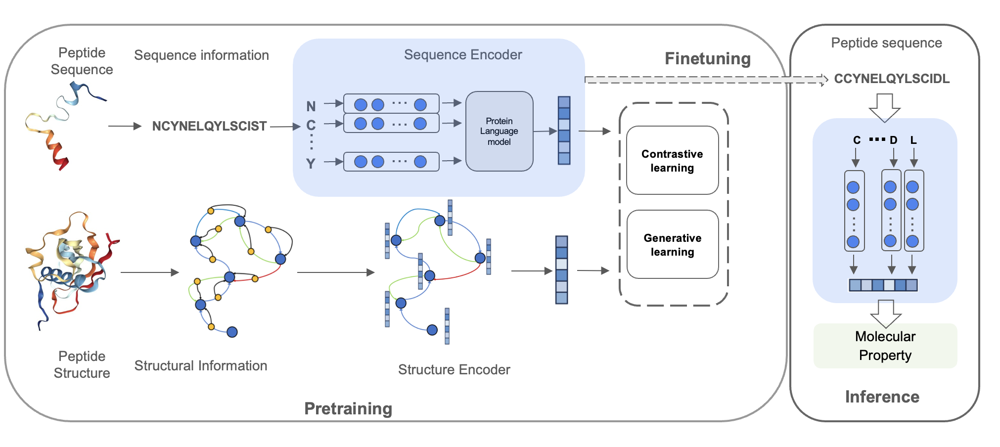

# PepHarmony

This repository contains the code for the paper [PepHarmony: A Multi-View Contrastive Learning Framework for Integrated Sequence and Structure-Based Peptide Representatio](https://arxiv.org/abs/2401.11360). 

## Introduction

Recent advances in protein language models have catalyzed significant progress in peptide sequence representation. Despite extensive exploration in this field, pre-trained models tailored for peptide-specific needs remain largely unaddressed due to the difficulty in capturing the complex and sometimes unstable structures of peptides. This study introduces a novel multi-view contrastive learning framework PepHarmony for the sequence-based peptide representation task. PepHarmony innovatively combines both **sequence**- and **structure**-level information into a **sequence-level encoding module** through contrastive learning. We carefully select datasets from the Protein Data Bank and AlphaFold DB to encompass a broad spectrum of peptide sequences and structures. The experimental data highlights PepHarmony's exceptional capability in capturing the intricate relationship between peptide sequences and structures compared with the baseline and fine-tuned models. The robustness of our model is confirmed through extensive ablation studies, which emphasize the crucial roles of contrastive loss and strategic data sorting in enhancing predictive performance. The training strategies and the pre-trained PepHarmony model serve as helpful contributions to peptide representations, and offers valuable insights for future applications in peptide drug discovery and peptide engineering. 

### Pepland Architecture



Overall architecture of the proposed PepHarmony framework. The sequence encoder and structural encoder are trained together by contrastive or generative learning. The downstream prediction tasks will just use the sequence coder to extract peptide representation.

### Evaluation Dataset
```
---data
  ---eval
    ---- aff.csv
    ---- CPP.txt
    ---- Sol.txt
```
### Pretrained Model Path

1. download the esm_t12 from: https://github.com/facebookresearch/esm and put it in the following path:

```
---data
  ---pretrained
    ---- esm2_t12/
      ---- esm2_t12_35M_UR50D-contact-regression.pt
      ---- esm2_t12_35M_UR50D.pt
    ---- mc_gearnet_edge.pth
    ---- siamdiff_gearnet_res.pth
```

### Further Pretrained Model Path (for downstream tasks in peptideeval)

- download the cpkts in the following link: [Google Drive](https://drive.google.com/file/d/15Ai_lOrsxQ11UlvHZcMbKvU9YMGRltYl/view?usp=drive_link)
- unzip the cpkts to the following path:
```
---data
    ---cpkt
        ---- af80_step_50: Multivew Gearnet + ESM; Further Pretrained on AF90
        ---- af890_step_50: Multivew Gearnet + ESM; Further Pretrained on AF80
        ---- pdb_step_50: Multivew Gearnet + ESM; Further Pretrained on PDB
```

### Use pretrained pepharmony model to extract peptide representation

```bash
python inference_sscp.py
```